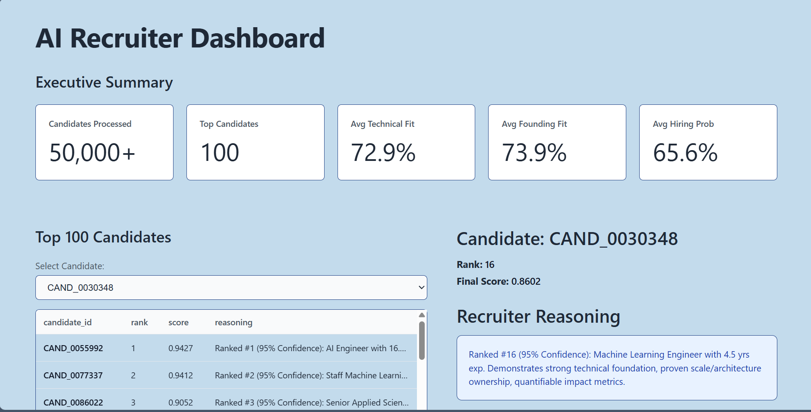

# Intelligent Candidate Discovery System



## Overview
This repository contains a comprehensive **Hybrid Semantic Retrieval & Candidate Ranking System** built for the Redrob AI Hackathon. 

Traditional applicant tracking systems rely heavily on keyword matching, which often overlooks capable engineers and disproportionately favors keyword stuffing. To address this, we implemented a structured evaluation framework that computationally models the candidate review process using dense vector embeddings, FAISS indices, and mathematical decay modeling for behavioral signals.

## Methodology
The system evaluates candidates across distinct dimensions using multi-faceted semantic search:

1. **Multi-Dimensional Technical Fit:** We chunk both the candidate profiles and the Job Description into distinct segments (e.g., Role Core, Infrastructure, Engineering). We compute vector similarity using SentenceTransformers (`all-MiniLM-L6-v2`) and FAISS to find precise contextual overlap rather than holistic document similarity.
2. **Seniority Trajectory:** Analyzes career progression to identify candidates who have successfully architected and owned systems, explicitly rewarding zero-to-one startup environments and structural engineering ownership.
3. **Behavioral Probabilistic Modeling:** Instead of linear step-functions, we evaluate candidate availability, responsiveness, and recency using continuous exponential decay models (e.g., $e^{-\lambda x}$).
4. **Factual Evidence Extraction:** The system algorithmically detects the presence of scale metrics (e.g., latency reductions, system scale, user metrics) within the candidate's resume to assign an evidence strength modifier.

## Architecture and Tools
- **Pipeline Orchestrator:** `src/build_ranking.py` coordinates the extraction, embedding, retrieval, and explainability generation.
- **Data Loaders:** Stream-based chunking of large JSONL applicant data (`src/pipeline/data_loader.py`).
- **Semantic Engine:** `all-MiniLM-L6-v2` bindings via `src/pipeline/embedding_engine.py`.
- **Vector Index:** `faiss-cpu` flat index used for real-time dense vector retrieval (`src/pipeline/retrieval_faiss.py`).
- **Explainability:** Traces semantic correlations back to the exact chunk of text in the candidate's profile to offer factual reasoning for the ranking score (`src/pipeline/explainer.py`).

## Repository Structure
- `src/pipeline/`: Contains the data ingestion, embedding, FAISS retrieval, and explainability extraction logic.
- `src/scoring/`: Contains the decoupled business logic for Technical, Seniority, and Behavioral scoring.
- `src/config.py`: Centralized parameter controls (weights, filepaths, batch sizes).
- `dashboard/`: Contains the Streamlit application for reviewing results.
- `outputs/`: Stores the generated CSV submission and transparent explainability logs.

## How to Run

1. Install required dependencies:
   ```bash
   pip install -r requirements.txt
   ```

2. Place the extracted challenge dataset into your local `challenge_data` directory, and verify the path mapping in `src/config.py`.

3. Execute the ranking pipeline:
   ```bash
   python src/build_ranking.py
   ```
   *(Note: The `config.py` is currently set to evaluate `MAX_CANDIDATES = 5000` for swift testing. Change this to `None` to process the entire dataset.)*

4. Launch the evaluation dashboard:
   ```bash
   python -m streamlit run dashboard/app.py
   ```

## Output Format
The system produces an output strictly compliant with the hackathon judging criteria.
You can validate it using:
```bash
python tools/validate_submission.py
```
