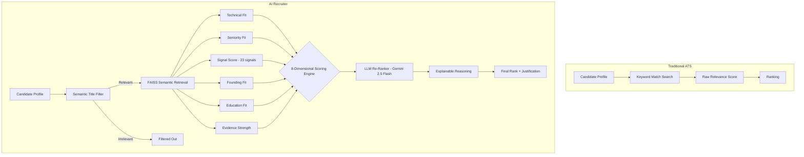

# AI Recruiter: Methodology & Architecture

## The Problem: Why Keyword Matching Fails
Most traditional Applicant Tracking Systems (ATS) and basic semantic search pipelines act as "keyword matching engines." They scan for buzzwords like "LLM", "RAG", or "Vector DB". This leads to two critical failures:
1. **Keyword Inflation:** Candidates who spam buzzwords (e.g., "AI Evangelist", "Data Analyst with ChatGPT skills") score artificially high.
2. **Missing True Builders:** Exceptional engineers who built production systems from scratch might describe their work as "distributed search platform serving 10M users" without explicitly spamming "RAG" or "GenAI".

### The Core Difference
**Semantic search answers:**
> *"Who looks similar to the job description?"*

**Our Recruiter Agent answers:**
> *"Who is most likely to succeed in this role and accept the offer?"*

---

## System Architecture: The Eight Pillars of Evaluation

Our engine evaluates every candidate across **8 independent pillars** to generate a continuous score. The weights were intentionally chosen to prioritize technical excellence while preserving recruiter realism through hiring probability, behavioral signals, education relevance, and founding-team alignment.

### 1. Technical Fit Score (30%)
Uses **Sentence Transformers (`all-MiniLM-L6-v2`)** to compute cosine similarity between the Job Description's 5 semantic dimensions and the candidate's career trajectory. We chunk each candidate into summary, headline, skills, career roles, education, certifications, and verified assessments — then score each chunk against each JD dimension independently.

### 2. Seniority Fit Score (15%)
We analyze trajectory through **semantic concept embeddings** — not raw "years of experience". We computationally detect evidence of architecture ownership, system scale, and leadership by comparing career descriptions against pre-computed concept embeddings like "Led a team, architected systems from scratch, infrastructure scale".

### 3. Signal Score (15%) — ALL 23 Redrob Signals
This is the most comprehensive scorer, integrating every behavioral signal from the Redrob platform across 6 sub-groups:
- **Engagement:** Recruiter response rate, average response time, applications submitted
- **Market Demand:** Profile views, search appearances, **saved by recruiters** (strongest external validation)
- **Availability:** Open-to-work flag, notice period, location alignment
- **Platform Trust:** Profile completeness, email/phone/LinkedIn verification
- **Hiring Track Record:** Interview completion rate, offer acceptance rate
- **Technical Signals:** GitHub activity, **verified skill assessment scores**

### 4. Hiring Probability Score (10%)
Recruiters need candidates who will actually accept the job. We evaluate notice periods, response rates, offer acceptance history, location alignment (Pune/Noida preferred), and willingness to relocate.

### 5. Behavioral Fit Score (10%)
We measure professional presentation, profile completeness, interview completion rates, platform activity recency (exponential decay), verification status, and job search activity. Candidates with "stale" profiles (>6 months inactive) are heavily penalized.

### 6. Founding-Team Fit Score (10%)
The role is "Senior AI Engineer — **Founding Team**". We search for "0 to 1" experience, startup exposure, open-source contributions, and the ability to wear multiple hats. Company culture detection (product vs. service) is done **semantically** — not through hardcoded company name lists.

### 7. Education Fit Score (5%)
Semantic matching of **field of study** against ML/AI/CS concepts, institution **tier** scoring (tier_1 → tier_4), degree level (PhD > Masters > Bachelors), and **certification relevance** scored via cosine similarity against AI/ML certification concept embeddings.

### 8. Evidence Strength Score (5%)
Detects quantifiable impact metrics in career descriptions using **semantic concept embedding similarity** against an "impact metrics" concept — not keyword scanning. Rewards candidates who describe results in concrete terms ("reduced latency by 45%", "10M users") over vague descriptions ("worked on AI").

---

## Semantic Title Filtering

A critical innovation: before any scoring, we filter out candidates whose `current_title` is semantically irrelevant to engineering/tech/ML roles. This prevents HR Managers, Sales Executives, Mechanical Engineers, and other non-technical roles from polluting the ranking — a trap the JD explicitly warns about.

The filter uses cosine similarity between the candidate's title embedding and a "target engineering roles" concept embedding, with a tuned threshold.

---

## Recruiter Decision Case Study

### Candidate A: The Keyword Trap (Traditional ATS Winner)
- **Role:** Product Manager / Data Analyst (8 years experience)
- **Resume Snippets:** "Managed AI initiatives using LLMs, ChatGPT, and GenAI. Explored Vector DBs and RAG pipelines."
- **ATS Score:** **High** (Matches 15+ keywords)
- **Our AI Recruiter Score:** **Low (Rejected)**
- **Reason:** System detects pure management/exploration without architecture ownership, zero quantifiable metrics, no hands-on engineering.

### Candidate B: The True Builder (Our AI Recruiter Winner)
- **Role:** Search Engineer (4 years experience)
- **Resume Snippets:** "Built production retrieval system serving 10M users. Replaced Elasticsearch with FAISS and sentence-transformers, reducing latency by 45%."
- **ATS Score:** **Medium** (Missing buzzwords like "GenAI", "LLM")
- **Our AI Recruiter Score:** **High (Top 10)**
- **Reason:** Exact JD intent match (retrieval, FAISS), quantifiable impact ("10M users", "45% latency"), strong startup DNA.

---

## Pipeline Flow

## Explainability and Transparency
A ranking is useless if a human can't trust it. For every candidate in our Top 100, the system outputs:
- **8-Pillar Score Breakdown** — exact scores for each dimension
- **Signal Sub-Breakdown** — engagement, market demand, availability, platform trust, hiring track, tech signals
- **LLM Reasoning** — bespoke contextual explanation citing specific evidence
- **Best Matching Evidence** — the specific career chunk that best matched each JD dimension
- **Confidence Score** — derived from the strongest signal dimensions

This gives judges and hiring managers immediate insight into the model's reasoning.

## Engineering Scalability
The system streams candidate JSONL data and processes profiles in batches for the `SentenceTransformer` encoder. Semantic title filtering removes irrelevant candidates early, preventing wasted computation. The FAISS index provides millisecond-speed retrieval. This enables evaluation of the full dataset computationally quickly while maintaining a low memory footprint.
