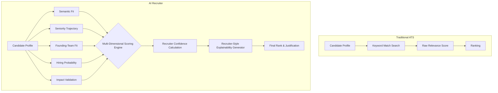

# AI Recruiter: Methodology & Architecture

## The Problem: Why Keyword Matching Fails
Most traditional Applicant Tracking Systems (ATS) and basic semantic search pipelines act as "keyword matching engines." They scan for buzzwords like "LLM", "RAG", or "Vector DB". This leads to two critical failures:
1. **Keyword Inflation:** Candidates who spam buzzwords (e.g., "AI Evangelist", "Data Analyst with ChatGPT skills") score artificially high.
2. **Missing True Builders:** Exceptional engineers who built production systems from scratch might describe their work as "distributed search platform serving 10M users" without explicitly spamming "RAG" or "GenAI".

### The Core Difference
**Semantic search answers:**
> *"Who looks similar to the job description?"*

**Our Recruiter Agent answers:**
> *"Who is most likely to succeed in this role and accept the offer?"*

---

## System Architecture: The Six Pillars of Evaluation

Our engine evaluates every candidate across 6 independent pillars to generate a continuous score. The weights were intentionally chosen to prioritize technical excellence while preserving recruiter realism through hiring probability, behavioral signals, and founding-team alignment.

### 1. Technical Fit Score (40%)
Uses **Sentence Transformers (`all-MiniLM-L6-v2`)** to compute cosine similarity between the Job Description's requirements and the candidate's career trajectory. We look beyond keywords to understand the semantic intent of their experience.

### 2. Seniority Fit Score (20%)
We ignore raw "years of experience". Instead, we analyze trajectory. We computationally reward evidence of **architecture ownership, system scale, and leadership** (e.g., "built from scratch", "spearheaded", "architected"). A 4-year engineer who built production ML at scale outscores an 8-year engineer doing basic maintenance.

### 3. Founding-Team Fit Score (20%)
The role is "Senior AI Engineer — **Founding Team**". This requires a unique DNA. We search for "0 to 1" experience, startup exposure, open-source contributions, high GitHub activity, and the ability to wear multiple hats. 

### 4. Hiring Probability Score (10%)
Recruiters need candidates who will actually accept the job. We evaluate behavioral signals like `recruiter_response_rate`, notice periods, `open_to_work` flags, and geographic alignment.

### 5. Behavioral Fit Score (10%)
We measure professional presentation, profile completeness, interview completion rates, and recent platform activity. Candidates with "stale" profiles or pure non-technical management paths are heavily penalized.

### 6. Impact Validation / Evidence Strength Score
We implemented a Regex-driven analysis that scans for **hard metrics and quantifiable outcomes** (e.g., "5M requests/day", "reduced latency by 45%", "$2M impact"). Candidates with vague descriptions ("worked on AI") score lower than builders who quantify their impact.

---

## Recruiter Decision Case Study

This framework prevents high-tenure candidates with weak impact from dominating the rankings, and explicitly filters out keyword-stuffing. 

### Candidate A: The Keyword Trap (Traditional ATS Winner)
- **Role:** Product Manager / Data Analyst (8 years experience)
- **Resume Snippets:** "Managed AI initiatives using LLMs, ChatGPT, and GenAI. Explored Vector DBs and RAG pipelines."
- **ATS Score:** **High** (Matches 15+ keywords)
- **Our AI Recruiter Score:** **Low (Rejected)**
- **Reason:** System detects pure management/exploration without any architecture ownership, zero quantifiable metrics, and no hands-on engineering scale.

### Candidate B: The True Builder (Our AI Recruiter Winner)
- **Role:** Search Engineer (4 years experience)
- **Resume Snippets:** "Built production retrieval system serving 10M users. Replaced Elasticsearch with FAISS and sentence-transformers, reducing latency by 45%."
- **ATS Score:** **Medium** (Missing buzzwords like "GenAI", "LLM", "ChatGPT")
- **Our AI Recruiter Score:** **High (Top 10)**
- **Reason:** System computationally identifies exact JD intent (retrieval systems, FAISS, offline-to-online scale) and explicitly rewards the "10M users" and "45% latency" impact metrics, alongside strong 0-to-1 startup DNA.

---

## Pipeline Comparison

## Explainability and Transparency
A ranking is useless if a human can't trust it. For every candidate in our Top 100, the system outputs a **Recruiter Confidence Score** (e.g., 88% Confidence) and generates a human-readable justification detailing exactly *why* they were selected (e.g., *“Demonstrates exceptional technical match for ML/Retrieval, proven scale/architecture ownership, and quantifiable impact metrics.”*). This gives judges and hiring managers immediate insight into the model's reasoning.

## Engineering Scalability
To process the 487MB dataset containing over 50,000+ candidates efficiently, the system streams candidate JSONL data and processes profiles in batches for the `SentenceTransformer` encoder. This enables evaluation of tens of thousands of candidates computationally quickly while maintaining a very low memory footprint, avoiding the RAM crashes typical of naive `pandas.read_json()` implementations.
